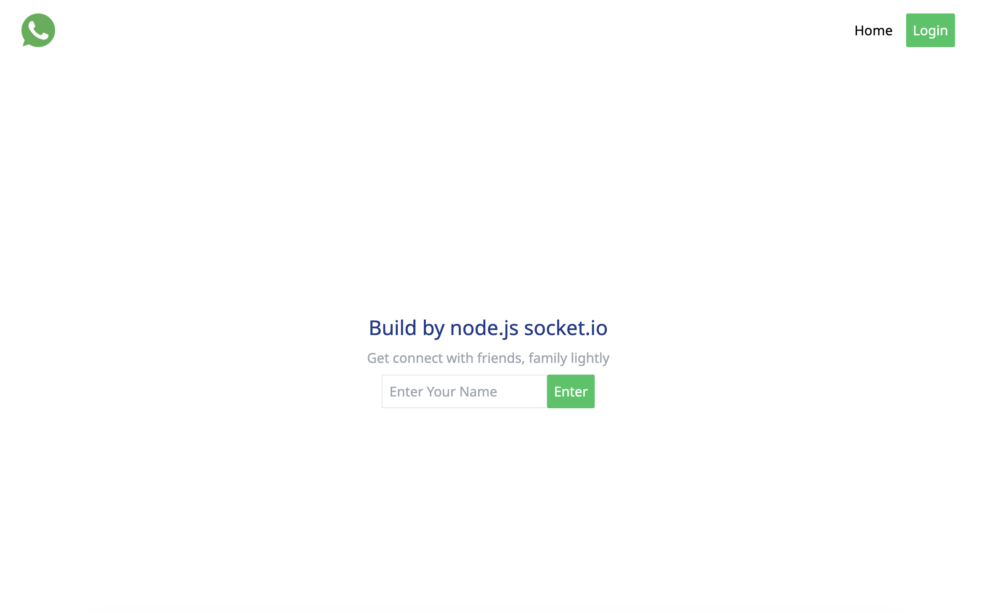
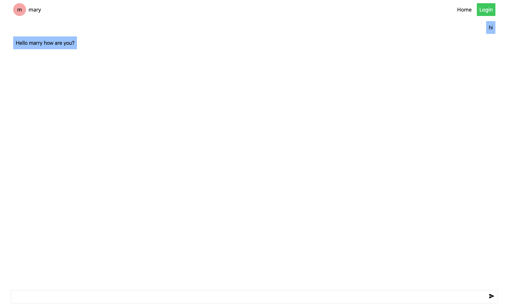
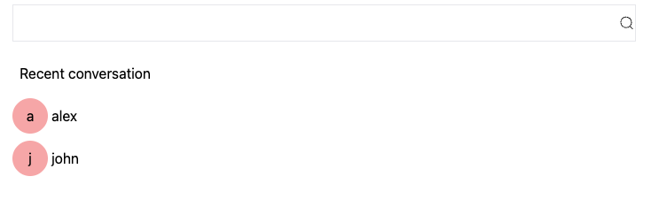
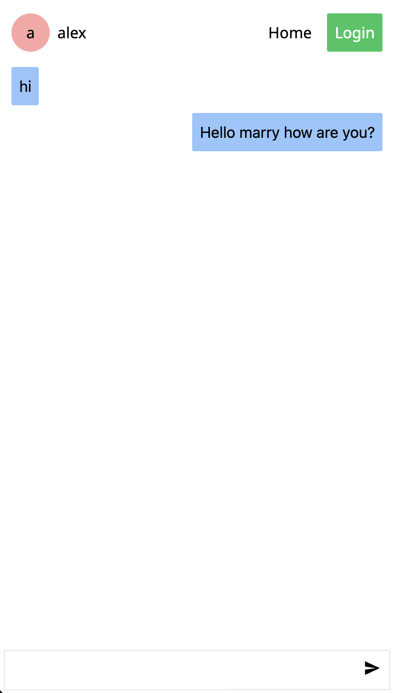

# 💬 Real-Time Chat Application

A real-time messaging system built with Socket.io that enables instant communication between users with live connection handling.

---

## 🚀 Features
- ⚡ Real-time messaging using Socket.io  
- 🔌 Live user connection & disconnection handling  
- 💬 One-to-one messaging  
- 🔄 Instant message updates (no refresh)  
- 🌐 Client-side routing with React Router  

---

## 🛠 Tech Stack
- ⚛️ React  
- 🔀 React Router  
- 🟢 Node.js  
- 🚂 Express  
- 🔌 Socket.io  

---

## 📂 Project Structure

```bash
project-root/
├── client/          # React frontend
│   ├── src/
│   └── ...
├── server/          # Express + Socket.io backend
│   ├── index.js
│   └── ...
├── screenshots/     # Project screenshots
├── README.md

```
## 📸 Screenshots

### 🖥 Home page Interface


### 🖥 Chat Interface


### 👥 Multiple Users Messaging


### 📱 Responsive View



